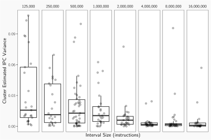

- **Super-sampling** existing profiling data to eliminate time spent resimulating programs for new interval sizes.
- Showing **truncated** checkpoints have similar error rates to traditionally collected checkpoints.
- Combine checkpoints of different interval sizes with design-space exploration tools to find performant microarchicture configurations quickly.

# SimPoint Process


Divide the execution of target binary into intervals

# SimPoint Process


Profile intervals, counting instructions run from each basic block

# SimPoint Process


Plot basic block vectors as points in a basic block space

# SimPoint Process


Perform $k$-means clustering to identify program phases

# SimPoint Process


Pick centre point from each cluster as that phases' SimPoint

# SimPoint Process


<!---->

Take checkpoints at each SimPoint we can resume from on-demand

# SimPoint Process Timing

| Step | Timing (minutes) |
|---|---|
| Profiling | 85 |
| Clustering | <1 |
| Checkpointing | 91 |
| Metric Estimation | 9 |

> Time required to carry out the SimPoint process on the zip benchmark from CoreMark-PRO.

# SimPoint Super-sampling


# Variance versus SimPoint interval size 

<!--
Hi

```{=latex}
\pause
```
-->


# Variance versus SimPoint interval size 


# Variance versus SimPoint interval size 



# Variance of SimPoints compared to random sampling


# SimPoint Truncation


1. Take a regular clustering of BBVs of size $N$
2. Scale down each BBV by factor $1 \over f$, creating $f$ points
3. A cluster also scaled down by $f$ fits the scaled data

# SimPoint estimate error versus interval size


# The trade-off between SimPoint error rate and simulation time


# Design-space Exploration


\quad

> Overview of HyperMapper, a design-space exploration tool

# Optimal configurations found over time


# Conclusions

* We developed a method for avoiding repeated profiling of the same binary when making BBVs for different interval sizes with no loss in accuracy
* Truncation of checkpoints can eliminate the need for reprofiling or recollecting checkpoints for an existing binary with little loss in accuracy
* Combining sets of SimPoints of different interval sizes with an existing design-space exploration tool finds optimal configurations twice as fast

# Combined design-space exploration using multiple SimPoint sets


