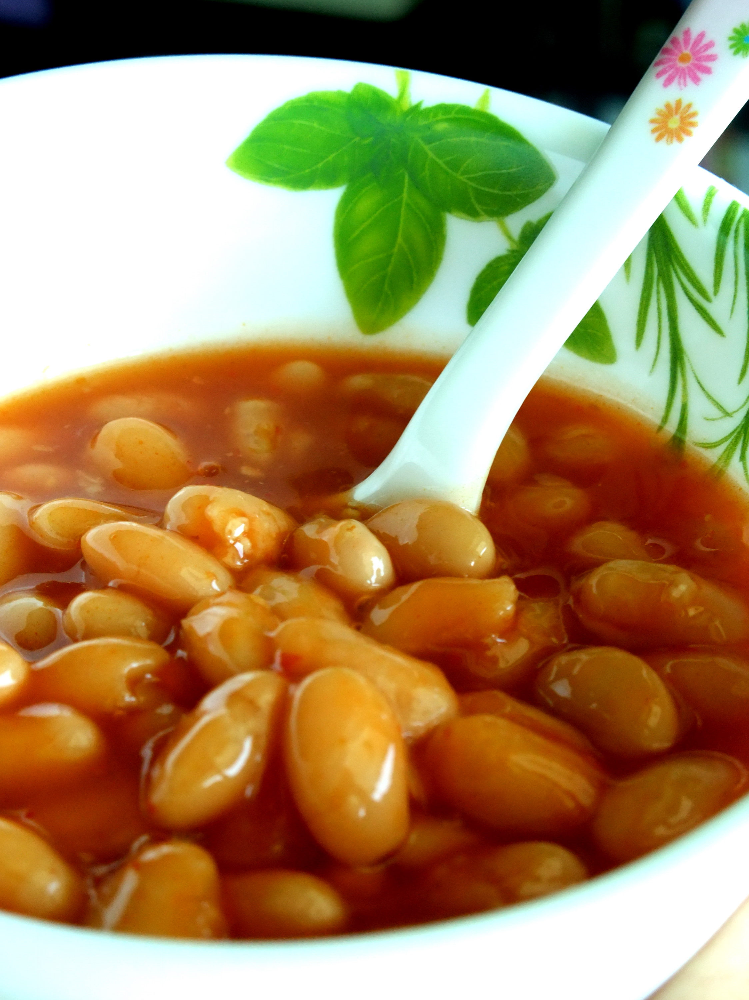

# Introduction

This is a paragraph[^footnote].

[^footnote]: It has a footnote as well

This is a reference to some paper [@mapreduce]. It's followed by a code block with syntax highlighting:

```c
int main(void) {
    int x = 45;
    int y = x * 56;
    return (x - y) + 7;
}
```

## Math

### Subheading

You can also do inline $x = y + 5$ and centered equations:

$$\phi = \sum_{i=0}^n {n^2 \over n \log y}$$



# Background

# Project Plan

# Evaluation Plan

# Ethical Issues

# Bibliography {.unnumbered}

::: {#refs}
:::
