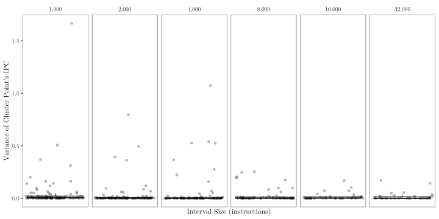

<!-- manually encode abstract & toc to get order right -->

```{=latex}
\begin{abstract}
```

Fast evaluation of new hardware ideas is important for effective architectural research. Representative sampling techniques such as SimPoint assist in this by estimating performance metrics from simulations of a part of a program. It has been shown that these estimates can be very accurate when simulation intervals are sufficiently long. This thesis introduces a technique for combining short and long simulation intervals with ML parameter optimisation techniques to find optimal hardware configurations. Our main contributions include:

- Investigating the trade-off between error and simulation time present when choosing a SimPoint set's interval size
- Discussing techniques for sub-sampling and super-sampling existing SimPoint BBV arrays to generate arrays with different interval sizes
- Demonstrating the viability of combining multiple SimPoint sets of different interval sizes with modern ML techniques for parameter optimisation to find performant configurations
- Presenting an implementation that can find global maximal configurations for given SPEC benchmarks with X% less simulation time than traditional techniques

The tools this thesis introduces will contribute to making architectural design space exploration cheaper and wide searches feasible in future research.

```{=latex}
\end{abstract}

\tableofcontents
```

# Introduction

Modern computer architecture research often simulates how new designs would perform on existing benchmark suites like SPEC CPU 2017 [@speccpu2017]. This is a lengthy process, with single runs taking weeks or months, a cost at odds with the desire to test many different configurations of hardware parameters (cache sizes and associativities, register counts, store queue lengths, etc.) to accurately identify globally minimally configurations and build a Pareto front[^pareto]. As a result, much research has been done both on speeding up simulators and reducing the amount of instructions that must be simulated to get an accurate benchmark result.

[^pareto]: The Pareto front is the set of "efficient" configurations which cannot be changed to improve on one metric (power usage, instructions per cycle, etc.) without another metric worsening.

This has resulted in the development of SimPoint [@simpoint1], a tool for identifying the phases of execution present in a program using clustering algorithms and extracting samples representative of those phases, allowing for accurate estimation of metrics whilst executing a fraction of a full benchmark. The number of instructions that need simulating and error of a given set of SimPoints is influenced by several variables, including the size of those generated samples [@tracedoctor].

In this document, we explore multiple techniques for splitting and combining collected SimPoint samples, and measure the effect these techniques have on the error rate of the resultant samples. Using this, we show that from a single set of collected BBVs[^bbvs], we can construct several sets of SimPoint samples with a range of error rates and simulation times.

[^bbvs]: Basic Block Vectors, for more see {@sec:simpoint}

\todo{random search/bay opt}

By combining the SimPoint approach with Bayesian optimisation, we will demonstrate a novel approach for design space exploration that uses multiple sets of differently-sized samples to estimate performance metrics for potential hardware configurations with confidence levels derived from our clustering probability model. By feeding this back into the Bayesian optimisation process, we can quickly assess the performance across the hardware configuration space whilst retaining a high level of confidence in the optimality of the final Pareto front.

We then demonstrate our implementation of this approach on a subset of SPEC CPU 2017 [@speccpu2017], showing that it identifies optimal hardware configurations faster than traditional techniques and is therefore a useful tool for future computer architecture investigations.

# Background

## Simulators

Fabricating new hardware is a long and expensive process, so simulators like gem5 [@gem5] and SimpleScalar [@simplescalar] are used to evaluate new microarchitecture designs. By running benchmark suites, collections of programs that are representative of common computing workloads, performance comparisons can be made with existing designs.

These simulators are both open-source, with their code and documentation available freely online. This makes it possible for researchers to extend them with novel hardware structures and examine the effects of these extensions on overall system performance.

Both SimpleScalar and gem5 provide different CPU models that span a spectrum between:

- Fast functional simulators that emulate just the instruction set of a machine such as gem5's `AtomicCPU` and SimpleScalar's `sim-fast`, which can achieve simulation speeds of 6 MIPS[^mips] [@simplescalar, Table 1], whilst collecting information on the flow of execution.
- Slower microarchitecture simulators that can track out-of-order scheduling, data hazards, functional units, cache hierarchies, etc. to produce accurate values for IPC[^ipc] when executing a given program. These cycle-accurate models include gem5's O3 model and SimpleScalar's `sim-outorder` which simulates at speeds of 0.3 MIPS.

[^mips]: MIPS: Millions of Instructions Per Second
[^ipc]: IPC: Instructions Per Cycle

### Abbreviated Runs

Evaluating a whole benchmark suite with a simulator's cycle-accurate model is temporally expensive, requiring weeks or months of CPU time for a single run, but simulating with a functional model will not produce as accurate performance metric values. To alleviate this, we can run our functional simulator for a few hundred million instructions to skip the program initialisation, then switch to our cycle-accurate simulator and continue running for hundreds of millions of instructions, using that model to collect a final performance metric. In 2003, [@smarts-paper] observed that "more than half of [papers in the last year] in top-tier computer architecture conferences presented performance claims extrapolated from abbreviated runs", but this approach can produce misleading results, as it may not accurately represent long-term program behaviour [@abbrunsinaccurate].

## Sampled Simulation Techniques

Accurate simulations of entire benchmark suites can take days or weeks to complete. Rather than simulate them entirely, we can simulate a portion and use that to estimate overall performance. This chapter discusses three different methods for picking a sample to simulate.

Many simulators offer both accurate cycle-level models and fast functional models. In order to achieve a balance between the accuracy and speed of these two models, we can run a cycle-accurate simulator on a subset of a program's complete execution and use the functional model for the rest. There are three main approaches to sampling a program [@simpoint-textbook, Ch 6] that can produce results that are representative of a programs varying behaviour:

- Random sampling, where we distribute the sets of instructions that we sample randomly throughout the entire execution
- Periodic sampling techniques, such as SMARTS (see {@sec:smarts}), where those sets are distributed regularly throughout the execution - the distance from one set to the next is predetermined
- Representative, or targeted, sampling techniques such as SimPoint (see {@sec:simpoint}), which start by analysing the program, then pick the sets of instructions to sample that collectively represent the full behaviour of the program

{\*@fig:sampling-techniques} shows one set of samples that could be picked using these three methods for a given program. The random samples are distributed randomly throughout the program whereas the periodic occur at regular intervals. Targeted samples are taken for the three different phases in the program, which correspond to the three different IPC behaviours.

![Potential sets of samples for the different sampling techniques, based on [@simpoint-textbook, Fig 6.2]](diagrams/sim-sample-techniques.drawio.svg){#fig:sampling-techniques}

### Statistical Sampling

Both random and periodic sampling are statistical sampling techniques that build upon existing mathematical theory, such as the central limit theorem, which is explained below.

The central limit theorem states that if sufficient independent observations are taken of a population (ie. more than thirty) with a finite variance $\sigma^2$ and mean $\mu$, then the distribution of the sample mean $\bar{x}$ approximates a normal distribution with mean $\mu$ and variance $\sigma^2 \over n$, irrespective of how the population is distributed.

Practically, if we use a statistical sampling method on a program and take $n$ samples of a performance metric, $[x_1, \ldots, x_n]$, we can calculate a sample mean $\bar{x}$ and sample variance $s^2$ as follows:

$$\bar{x} = {\sum_{i=1}^n x_i \over n}$$

$$s^2 = {\sum_{i=1}^n (x_i - \bar{x})^2 \over n - 1}$$

Then the distribution of $\bar{x}$ approximates a normal distribution with the true value of the performance metric for the program as its mean. We can use this to find a confidence interval for the sample mean to an amount of confidence $c$, for instance 99%:

$$\left[ \bar{x} - z_{1-c \over 2} {s \over \sqrt{n}}, \bar{x} + z_{1-c \over 2} {s \over \sqrt{n}} \right]$$

Where the value $z_{1-c \over 2}$, the $(100c)$th percentile of the standard normal distribution, is taken from a precomputed table. The probability that the true mean value of the metric $\mu$ resides within this interval is $c$.

### SMARTS

SMARTS [@smarts-paper] is a periodic sampling technique that switches at regular intervals between an accurate cycle-level simulation used to collect metrics and a fast functional simulator that quickly reaches the next sampling point.

[@smarts-paper] uses the mathematical theory in {@sec:statistical-sampling} to predetermine the size, $n$, of program samples based on a desired confidence level of the final performance metric. This also requires the calculation of a coefficient of variation $V$:

$$V = {\sigma \over \mu}$$

This typically is not known beforehand, so the SMARTS approach estimates its value using an initial large sample of size $n_\textnormal{init}$. If this initial sample's variance, $\hat{V}$, is insufficient for the target confidence level, then a new value for the size of the sample $n_\textnormal{tuned}$ can be calculated from $\hat{V}$.

Once we know how large to make the sample, the SMARTS technique involves alternating between running a cycle-accurate and functional simulator model. The final metric result is calculated based on the $n$ sample phases. We also track the measured coefficient of variance $\hat{V}$ so we can compute the confidence bounds on our estimate. The value of $\hat{V}$ can also be reused to calculate the initial sample size for future experiments on the same program.

#### Warm-up

One practical concern to handle when switching between functional and cycle-accurate simulation is warming up the processor. Modern processors contain a lot of internal state essential for achieving good performance, including branch predictors for prefetching upcoming instructions and multiple levels of caching to speed up accesses with temporal locality, that is not maintained during functional simulation. As such, if nothing is done they will be stale or "cold" upon switching to the cycle-accurate simulation, leading to an increase in cache misses and branch mispredictions that would not occur in a complete execution. Without warm-up, these misses and mispredications would increase the error in estimated performance metrics.

How best to solve this has been the subject of research. [@samplestartcontextswitch] proposed a method where samples start being collected only after a context switch, under the assumption that at least for smaller caches, the cache will be flushed during the switch. [@reversestatereconstruction] suggests tracking the data that is needed for reconstructing architecture state during functional simulation, so that once the switch to cycle- accurate simulation is made, the processor structures can be filled back up in reverse. SMARTS approaches this problem in two ways: with detailed warming and with functional warming.

Before each sample of size $n$, SMARTS has a period of detailed simulation of size $w$ that is not recorded, called detailed warming. This period fills the cache back up with fresh information so that the sample is executing in an environment as close to reality as possible. Picking a value for $w$ is tricky, as it adds a lot of cost to the overall simulation and the best value is highly dependant on the program being executed, so [@smarts-paper] also introduced the concept of functional warming, a middle point between functional simulation and detailed warming. By augmenting the functional simulator model with the ability to maintain some of the microarchitecture state, notably the branch predictor and caches, $w$ can be reduced at the cost of a "small" slowdown in-between samples[^slowdown].

The resulting sampling looks as follows:

1. $n(k - 1) - w$ instructions are executed through functional warming
2. $w$ instructions are executed through detailed warming to prepare the architecture state not maintained through functional warming
3. $n$ instructions are executed in detailed mode with the cycle-accurate simulator in order to collect the measured performance metric

[^slowdown]: The paper implemented a functional warming model that could operate at 55% the speed of the existing function simulation model.

### SimPoint

SimPoint is a targeted sampling technique that tracks the code executed by a program and uses that to decide where to sample in order to include all the behaviours it exhibits. This chapter will introduce the technique and discuss some further research to extend its functionality.

![A summary of the original SimPoint [@simpoint1] process](diagrams/simpoint-overview.drawio.svg){#fig:simpoint-summary}

SimPoint is composed into three parts, collection of a program trace, use of that program trace to identify the different phases of behaviour in the program and selection of samples to simulation from each of those phases. The process of identifying phases is shown in {@fig:simpoint-summary} which is labelled as follows:

1. Simulate the entire program on a simplified CPU, tracking the basic blocks ({@sec:basic-blocks}) being executed in order to build basic block vectors (BBVs)
2. Represent those vectors as points in a basic block space
3. Perform a random linear map on the set of BBVs to reduce the dimensionality of the data
4. Group the BBVs using $k$-means clustering ({@sec:k-means-clustering}), which identifies the phases in the program
5. Pick a BBV, and corresponding interval, closest to the centre of each cluster to represent it, recording the proportion of BBVs in that cluster

To produce a final performance metric, we do a detailed simulation of the chosen BBVs for each cluster, collecting performance metrics of interest. We then weight the performance metrics of each phase by the proportion of BBVs in that phase's cluster. One advantage SimPoints has over statistical sampling techniques is that as it has more information on the execution of the program, it can take less samples than SMARTS might and still produce an accurate estimate, reducing the required runtime of our simulation.

#### Basic Blocks

Introduced by [@simpoint1], SimPoint is based on the insight that many programs have repeated phases of similar behaviour. By identifying these phases and simulating samples of the program that exhibit those phases' behaviours, we can produce good estimates for metric values over the whole runtime of the program. The behaviour of a given section of a program can be characterised by the instructions it executes [@bbv-perf-correlation], and so the SimPoint approach identifies phases by considering basic blocks, sections of the program with a single entry and exit point that contain no control flow. For example, the following C function to find the maximal element of an array has 6 basic blocks, annotated 1-6 in the x86 assembly output on the right:

```{=latex}
\begin{multicols}{2}
```

```c
int maxArr(int *arr, int len) {
    if (len <= 0)
        return -1;
    
    int max = arr[0];
    for (int i = 1; i < len; i++)
        if (arr[i] > max)
            max = arr[i];
    return max;
}
```

[_Compiled with GCC 14.2 using Godbolt_](https://godbolt.org/#g:!((g:!((g:!((h:codeEditor,i:(filename:'1',fontScale:14,fontUsePx:'0',j:1,lang:c%2B%2B,selection:(endColumn:20,endLineNumber:15,positionColumn:20,positionLineNumber:15,selectionStartColumn:20,selectionStartLineNumber:15,startColumn:20,startLineNumber:15),source:'%23include+%3Cstdio.h%3E%0A%0Aint+maxArr(int+*arr,+int+len)+%7B%0A++++if+(len+%3C%3D+0)%0A++++++++return+-1%3B%0A++++%0A++++int+max+%3D+arr%5B0%5D%3B%0A++++for+(int+i+%3D+1%3B+i+%3C+len%3B+i%2B%2B)%0A++++++++if+(arr%5Bi%5D+%3E+max)%0A++++++++++++max+%3D+arr%5Bi%5D%3B%0A++++return+max%3B%0A%7D%0A%0Aint+main(void)+%7B%0A++++int+a%5B4%5D+%3D+%7B-17,+34,+34,+34%7D%3B%0A++++printf(%22%25d%5Cn%22,+maxArr(a,+2))%3B%0A++++return+0%3B%0A%7D'),l:'5',n:'0',o:'C%2B%2B+source+%231',t:'0')),k:33.333333333333336,l:'4',n:'0',o:'',s:0,t:'0'),(g:!((h:compiler,i:(compiler:g142,filters:(b:'0',binary:'1',binaryObject:'1',commentOnly:'0',debugCalls:'1',demangle:'0',directives:'0',execute:'0',intel:'0',libraryCode:'0',trim:'1',verboseDemangling:'0'),flagsViewOpen:'1',fontScale:14,fontUsePx:'0',j:1,lang:c%2B%2B,libs:!(),options:'-O',overrides:!(),selection:(endColumn:17,endLineNumber:9,positionColumn:17,positionLineNumber:9,selectionStartColumn:17,selectionStartLineNumber:9,startColumn:17,startLineNumber:9),source:1),l:'5',n:'0',o:'+x86-64+gcc+14.2+(Editor+%231)',t:'0')),k:33.333333333333336,l:'4',n:'0',o:'',s:0,t:'0'),(g:!((h:output,i:(compilerName:'x86-64+gcc+14.2',editorid:1,fontScale:14,fontUsePx:'0',j:1,wrap:'1'),l:'5',n:'0',o:'Output+of+x86-64+gcc+14.2+(Compiler+%231)',t:'0')),k:33.33333333333333,l:'4',n:'0',o:'',s:0,t:'0')),l:'2',n:'0',o:'',t:'0')),version:4)

```{=latex}
\columnbreak
```

```asm
maxArr(int*, int):
        test    esi, esi                ; --- BB #1
        jle     .L4                     ; __|
        mov     edx, DWORD PTR [rdi]    ; --- BB #2
        cmp     esi, 1                  ;   |
        jle     .L1                     ; __|
        lea     rax, [rdi+4]            ; --- BB #3
        lea     ecx, [rsi-2]            ;   |
        lea     rsi, [rdi+8+rcx*4]      ; __|
.L3:
        mov     ecx, DWORD PTR [rax]    ; --- BB #4
        cmp     edx, ecx                ;   |
        cmovl   edx, ecx                ;   |
        add     rax, 4                  ;   |
        cmp     rax, rsi                ;   |
        jne     .L3                     ; __|
.L1:
        mov     eax, edx                ; --- BB #5
        ret                             ; __|
.L4:
        mov     edx, -1                 ; --- BB #6
        jmp     .L1                     ; __|
```

```{=latex}
\end{multicols}
```

By tracking which basic blocks are executed in an interval we get a "fingerprint" for its behaviour. If two intervals execute the same or similar basic blocks, they executed similar instructions and so the measured value of metrics should also be similar. More formally, we build Basic Block Vectors (BBVs) at regular intervals, typically on the order of millions of instructions, during execution of the program. A BBV is a one-dimensional vector with an entry for each basic block present in the entire program, holding the number of times during the interval an instruction from that basic block was executed. The BBV stores the number of instructions executed from each basic block, rather than the number of times each basic block was executed, so that short basic blocks are not overrepresented when they are executed many times, as each run constitutes less of the overall execution than a run of a longer basic block.

We can treat all the collected BBVs as points in an $n$-dimensional space, where $n$ is the number of basic blocks in the program. Then, the Euclidean distance between two points can be used as a metric for their similarity, calculated as follows for two BBVs $(a_1, \ldots, a_n)$ and $(b_1, \ldots, b_n)$:

$$\sqrt { \sum_{i=1}^n (a_i - b_i)^2 }$$

To identify the phases of the program from the BBVs, we want to find groups of points in our space that are close together, and so have similar program behaviour. This is a clustering problem which can be solved using algorithms from the field of machine learning. The original implementation, [@simpoint1], used $k$-means clustering, which is briefly discussed below.

<!-- whereas [@simpoint-clustering] proposed using multinomial clustering instead. These are briefly discussed below.

### Clustering
-->

#### $k$-Means Clustering

$k$-Means clustering iteratively splits BBVs into $k$ sets, where $k$ is chosen before the process begins. First, a random linear map is performed on the BBV space to reduce the dimensions from the, potentially very high, number of basic blocks in the program, typically to fifteen - this avoids "the curse of dimensionality", where a high number of dimensions reduces the effectiveness of $k$-means clustering. Then, $k$ random points are picked to act as the initial centres of each set, and the following steps are followed:

1. For each BBV, measure its Euclidean distance to each centre and assign it to the centre closest to it
2. For each centre, calculate the mean average position of every BBV assigned to it and move that centre to there

These two steps are repeated until which BBVs are assigned to which clusters stops changing. The BBV closest to each cluster’s centre is the one used to represent the whole cluster. In addition to recording that, the number of BBVs in each cluster is recorded. Estimating a performance metric then consists of fast-forwarding to the start of each clusters representative BBV using a functional simulator model[^warming], recording that metric during the sampled interval, and fast-forwarding to the next cluster. Once collected, the metrics for each cluster are combined into an average weighted by the number of BBVs in each cluster. For instance, given a clustering, $C$, and an array of collected metrics, $M$, we can calculate a final estimate for the metric, $E$, as follows:

[^warming]: No consideration is needed for warming up architecture state as SimPoint has larger simulation intervals than SMART [@smarts-paper, Ch 5.3]

$$C = \left\{c_1: [BBV_1, BBV_5, \ldots], c_2: [BBV_2, BBV_4, \ldots], \ldots, c_k: [BBV_3, BBV_9, \ldots]\right\}$$

$$M = [m_1, \ldots, m_k]$$

$$E = {\sum_{i=0}^k m_i |c_i| \over \sum_{i=0}^k |c_i|}$$

The value of $k$ picked is important - too low and the final clusters may not represent the full execution, too high and multiple similar BBVs are picked as centres, increasing simulation time without benefiting the accuracy of the final result. To pick the best value of $k$, the SimPoint approach iterates through values from one up to the maxK parameter, performing a $k$-means clustering for each. Then, a metric called the Bayesian Information Criteria (BIC) is calculated for each one, that measures how well the clustering formed fits the data present. [@simpoint1] uses a definition of BIC from [@bic] which is briefly described below.

The BIC is made up of a likelihood and a penalty. The likelihood characterises how well the data fits the model - if each cluster is modelled as a spherical Gaussian distribution, the likelihood of the entire clustering is the product of the likelihood of each cluster, which in turn is the product of the probabilities of each point to be in its clusters Gaussian distribution. More clusters reduce this probability without needing to describe the data any better, so there’s a need for a second term to compensate, a penalty that increases the more nodes there are.

These terms are as follows, where $R$ is the number of BBVs, $R_i$ is the number of BBVs in cluster $i$, $\sigma^2$ is the mean variance of the distance from each BBV to its cluster's centre, $d$ is the number of dimensions to the data, there are $k$ clusters, $p_j$ is the number of parameters and $l(D \mid k)$ the likelihood of the data being distributed as $D$ given $k$ clusters:

$$l(D \mid k) = \sum_{i=1}^k - {R_i \log 2\pi \over 2} - {R_i d \log \sigma^2 \over 2} - {R_i - 1 \over 2} + R_i \log {R_i \over R}$$

$$p_j = (k - 1) + dk + 1$$

$$\textnormal{BIC}(D, k) = l(D \mid k) - {p_j \log R \over 2}$$

Once a BIC score is generated for the all the $k$ SimPoint is considering, it determines the greatest score, $\textnormal{BIC}_\textnormal{max}$ and then multiplies it by the BIC threshold parameter. The SimPoint approach then picks the clustering with the smallest $k$ that has a BIC clustering greater than that product [@tracedoctor].

<!--
#### Multinomial Clustering

The process of $k$-means clustering is fast, however it is not guaranteed to find an optimal solution and

...
-->

#### Early Points

Picking SimPoints from the centre of the detected clusters ensures they are representative of the BBVs in that cluster, but it can also result in functionally simulating through other intervals with very similar behaviour. [@simpoint-early-and-stats] recognises this and extends the SimPoints approach to consider how far an interval is through the program when picking which one represents each cluster. The aim is to pick a representative cluster that is earliest in the program, such that simulation time, either during fast-forwarding or while taking checkpoints, is minimised.

To try and choose clusterings where there is a BBV that occurs early in every cluster, the authors created a new variable _EarlySP_, based on the BIC score, where _StartLastCluster_ is a percentage representing how far through execution the last cluster is encountered, and $w$ is a weight to influence the impact this has on the final BIC:

$$\textit{EarlySP} = \textnormal{BIC} \times \left(1 - {\textit{StartLastCluster} \over w}\right)$$

Once a value of $k$ and a BBV clustering has been decided using this new BIC, an upper bound on how far through the binary we will to simulate is determined by picking an early sample from the cluster whose centre is latest in the binary. This early sample is picked by ordering all the BBVs for that latest cluster by Euclidean distance to the centre, then picking the BBV from the top 1% that occurs earliest. Then, when picking simulation points from other clusters, we limit our choice to BBVs that occur before this upper bound, otherwise following the standard SimPoint procedure in picking the closest BBV to the centre of each cluster.

#### Limitations

As the collection of BBVs requires identifying all the basic blocks in a program, we’re limited to analysing non-self-modifying binaries. For just-in-time (JIT) compiled programs, recompilation of a function with optimisations enabled will obscure the similarity in code calling that function after from those calls before the recompilation, and reuse of code cache in long-running programs could create false similarity between unrelated intervals. This hinders the ability of the SimPoint approach to identify phases accurately.

#### Validation Studies

The effectiveness of the SimPoints approach in accurately estimating performance metrics has been shown experimentally. The original authors demonstrated its effectiveness in estimating the CPI of SPEC CPU benchmarks in [@simpoint-early-and-stats], and [@power-simpoint] verified these results and extended them to show the SimPoint approach could also be used to estimate power usage.

## Bayesian Optimisation

Bayesian optimisation is an approach to determine the minimal value of a function with few evaluations of the function. Modern Bayesian optimisers [@hypermapper2] can work with multiple discrete or continuous parameters with constraints on their values. This makes them ideal for working with hardware parameters, where we want to limit exploration to designs that are feasible. They also have the ability for a user to pass in a prior distribution, representing preexisting knowledge about the problem space and where the optimal solution may exist that can be used to drive where we evaluate the function next.

# Generating Basic Block Vectors

The first step in building multiple sets of simpoints is collecting an array of basic block vectors (BBVs) (see {@sec:simpoint}) for each simulation interval $i_1, i_2, \ldots, i_N$ of interest. The gem5 simulator [@gem5] has the ability to generate BBVs from a functional simulation of a program for a single given target interval. We could repeat this simulation for each interval we want a set of simpoints for, requiring time linear with respect to $N$. This entails inefficiently simulating an identical program multiple times - we can instead take an existing BBV array and "super-sample" it to construct a BBV of a greater interval or "sub-sample" it to produce one of a smaller interval, without additional simulation. In this chapter, we will discuss methods for sub- and super-sampling BBV arrays and their trade offs. 

As a reminder, a BBV expresses the behaviour of a single interval in a program as a vector storing the number instructions executed in that interval from each basic block in the entire program. A sequence of BBVs then represents the behaviour of an entire program where the first element represents the first interval's worth of instructions, the second the behaviour of the instructions in the second interval, and so on, forming an array of BBVs.

## Super-sampling

In order to create sets of BBV arrays with different interval sizes, we can collect one set and scale it up to produce BBV arrays of greater sizes, saving simulation time collecting BBVs.

Take $a$ and $b$, two program intervals of length $N$; let the BBVs of these program intervals, the number of instructions executed from each basic block in each interval, be $B^N_a$ and $B^N_b$. The sum of their components is the number of instructions executed from each basic block in both $a$ and $b$. In an execution flow where $a$ is followed by $b$, $ab$, this is identical to a BBV taken from the beginning of $a$ of size $2N$, $B^{2N}_ab$. This is the basis of our subsampling approach, where BBVs of neighbouring intervals are combined to form the BBV of the sum interval, as illustrated in @fig:supersample-approach.

{#fig:supersample-approach}

Our approach to generate a set of BBV arrays given a set of output intervals, $is$ is:

1. Pick the smallest interval in $is$, $i_0$ as the *input interval size*
2. Create an empty BBV array for each other interval in $is$
3. Run a simulation of the program to generate an initial set of BBVs of interval size $i_0$
4. Iterate over each BBV in the generated array, tracking for each interval in $is$ other than $i_0$ a mutable BBV and an instruction counter. For each BBV:
    a. Add this iteration's BBV to each mutable BBV and add $i_0$ to each instruction counter
    b. For each interval whose instruction counter equals its interval size, append its mutable BBV to its BBV array and reset that intervals counter and mutable BBV

In the optimal configuration, where the input interval size is a factor of every output interval size, we produce BBVs identical to those that would have been produced if we had done separate simulations for each interval. We also require less simulation time with our approach, using a constant amount of compute with respect to the number of target intervals.

For non-optimal configurations of intervals we add to $is$ the greatest common factor of each interval in $is$ and carry out the steps above. This does not add much simulation cost to the overall generation \todo{Plot this} as the interval size does not have a large impact on overall simulation time.

<!--
## Sub-sampling

Collecting an array of BBVs for a fresh interval size requires simulating the entire program. Even though this can be done with a functional simulator, it still takes a significant amount of time for large programs. Our super-sampling approach requires we collect an array of BBVs for the smallest sized interval we want to simulate with. We now introduce a method for producing sets of BBVs of an interval width greater than the target interval size. This enables the creation of a set of BBV arrays from a preexisting large BBV array, such as the commonly used one million wide interval size used in existing SimPoint research [@simpoint1; @power-simpoint].

Let a BBV of width $2N$, $B^{2N}_{ab} = \{3, 0, 6, \ldots\}$, contain the number of instructions executed from two continuous intervals $a$ and $b$ of length $N$. We have no way to determine the exact split of instructions between the two intervals, but we can estimate it by dividing the instructions equally between $a$ and $b$. This creates two new smaller BBVs of width $N$. The SimPoint implementation available publicly only accepts BBVs made up of integers, \todo{check this} so we round one down and one up forming split BBVs as follows:

$$B^N_a = \left\lceil {B^{2N}_{ab} \over 2} \right\rceil \qquad B^N_b = \left\lfloor {B^{2N}_{ab} \over 2} \right\rfloor$$
-->

## Sub-Sampling through Checkpoint Truncation

Collecting an array of BBVs for a fresh interval size requires simulating the entire program. Even though this can be done with a functional simulator, it still takes a significant amount of time for large programs. Our super-sampling approach requires we collect an array of BBVs for the smallest sized interval we want to simulate with. We now introduce a method for doing SimPoint analysis with an existing set of SimPoint checkpoints built on a large interval size, such as the several million instruction wide interval sizes commonly used in existing SimPoint research [@simpoint1; @power-simpoint; @dagguise].

Take a BBV of width $N$, $B^{N}_{ab} = \{3, 0, 6, \ldots\}$, containing the number of instructions executed from two continuous intervals $a$ and $b$ of length $N \over 2$. We have no way to determine the exact split of instructions between the two intervals, but we can estimate it by dividing the instructions equally between $a$ and $b$. This creates two new smaller BBVs of width $N \over 2$, $B^{N \over 2}_a$ and $B^{N \over 2}_b$, both equal to $\{1.5, 0, 3, \ldots\}$. This approach generalises to any scaling factor $f$, where $0 < f < N$ - we can create $f$ smaller BBVs of width $N \over f$ by dividing each component of $B^{N}$ by $f$.

This process does not have an effect on the final clustering. Take a clustering of points $p_1, p_2, \ldots$

{#fig:clustering_scaling}

This approach has the downside of obscuring periodic behaviour that occurs over time-spans within the original interval size but wider than the sub-sampled interval size. Periodic behaviour that occurs over time-spans greater than the original is identified through the clustering process of the original SimPoint process, during which checkpoints are created for the different phases. However, for periodic behaviour occurring entirely within an interval size's worth of instructions, a subset of the beginning of that interval may not encounter all phases of the behaviour, leading to greater metric approximation errors.

# The Behaviour of SimPoint sets

## Methodology



## Methodology

## Results

# Future Work

- Incorporating BBV generation into Gem5

<!--
# Project Plan

1. Improved background **(31st Jan)**
    - Get on repo, topics covered in more depth, diagrams improved
    - Verify intuition on Simpoint limitations
2. Minimal viable project **(14th Feb)**
    - Hypermapper v2.0 being fed a prior from one smaller set of SimPoint samples and evaluating a function on a larger set of SimPoint samples
    - Good chance to compare initial sampling methods (random, hypercube, etc.)
    - Get R/tidyverse flow working in repo
3. Move to Hypermapper v3.0, using multiple layers of priors **(28th Feb)**
    - Sets of intervals of size n, 2n, 4n, . . .
    - Variance calculated using result from [@earlyVarianceSimpoints]
        - In the event this doesn't work, or is too slow, build a heuristic
4. Investigate simpoint splitting techniques **(6th March)**
    - Build on variance result, collect variances for multiple sets in a single run
    - Look into combining intervals (ie. same cluster for n and 2n, reuse checkpoint)
5. I'm blocking off **(7th-28st March)** for exams & exams prep + 1 week holiday
6. On return during summer term, finish anything unfinished from spring term,
    - Combine above work into a usable tool
        - Python
    - Investigate questions posed as a result of 1-5
    - Gather more data on a wider range of benchmarks, see Chapter X
    - Graphs, wonderful graphs
7. Have first draft of final report done by **(11th April)**
8. Have final report finished by **(23rd May)**, leaving time for Paul/Jacky to go over it and some wiggle room for things to be delayed.


# Evaluation Plan

# Ethical Issues

If we go down the route of assessing the usability of the final tool through questionnaires of potential users, considerations will have to be made for anonymisation of recipients, the secure storage of replies and fulfillment of our requirements under GDPR.

No other ethical issues exist.

# Images

-->

<!--  -->

# Bibliography {.unnumbered}

::: {#refs}
:::
